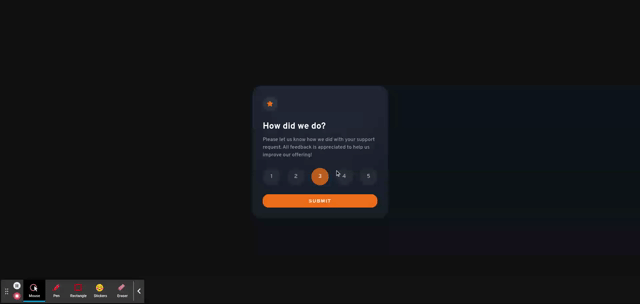

<h1 align="center">  
  Interactive Rating ReactJs
</h1>

<h4 align="center">This is my version of the  <a href="https://www.frontendmentor.io/challenges/interactive-rating-component-koxpeBUmI" target="_blank">Interactive Rating Component Challenge</a> presented by <a href="https://www.frontendmentor.io/home" target="_blank">FrontendMentor</>.</h4>

<p align="center">
  <a href="#key-features">Key Features</a> •
  <a href="#how-to-use">How To Use</a> •
  <a href="#resources">Resources</a> •
  <a href="#license">License</a> •
  <a href="#license">About me</a>
</p>

<div align="center">
  
</div>

## Key Features

- Rate page with buttons to vote.
- Result page with your selected vote.

## How To Use

To clone and run this application, you'll need [Git](https://git-scm.com) and [Node.js](https://nodejs.org/en/download/) (which comes with [npm](http://npmjs.com)) installed on your computer. After clone, from your command line:

```bash
# Go into the repository
$ cd electron-markdownify

# Install dependencies
$ npm install

# Run the app
$ npm start
```

## Resources

This software uses the following open source packages:

- [ReactJs](https://pt-br.reactjs.org/)
  - Components
  - Props
- [React Router Dom](https://v5.reactrouter.com/web/guides/quick-start)
- [Styled Components](https://styled-components.com/)

## Links

[Interactive Rating Site](https://interactive-rating-yasminbraga.netlify.app/)

## License

MIT

---

## About me

- Rocketseat - [Yasmin Braga](https://app.rocketseat.com.br/me/yasmin-braga-1568974763)
- Frontend Mentor - [@yasminbraga](https://www.frontendmentor.io/profile/yasminbraga)
- Instagram - [@yasminbragat](https://www.twitter.com/yasminbragat)
- Twitter - [@minbragat](https://www.twitter.com/minbragat)

Made with :heart: by [Yasmin Braga](https://github.com/yasminbraga)
